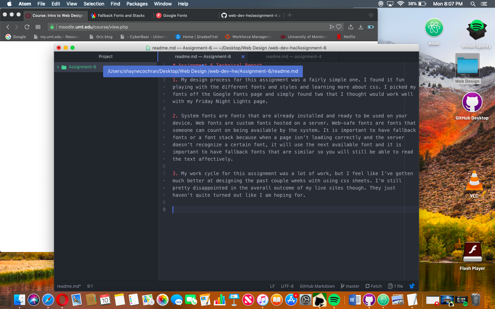

# Assignment 6 Technical Report

1. My design process for this assignment was a fairly simple one. I found it fun playing with the different fonts and styles and learning more about css. I picked my fonts off the Google Fonts page and simply found two that I thought would work well with my Friday Night Lights page.

2. System fonts are fonts that are already installed and ready to be used on your device. Web fonts are custom fonts hosted on a server. Web-safe fonts are fonts that someone can count on being available by the system. It is important to have fallback fonts or a font stack because when a page isn't loading correctly and the server doesn't recognize a certain font, it will use the next available font and it is important to have fallback fonts that are similar so you will still be able to read the text affectively. 

3. My work cycle for this assignment was a lot of work, but I feel like I've gotten much better at designing the past couple weeks with using css sheets. I'm still pretty disappointed in the overall outcome of my live sites though. They just haven't quite turned out like I am hoping for.

 
