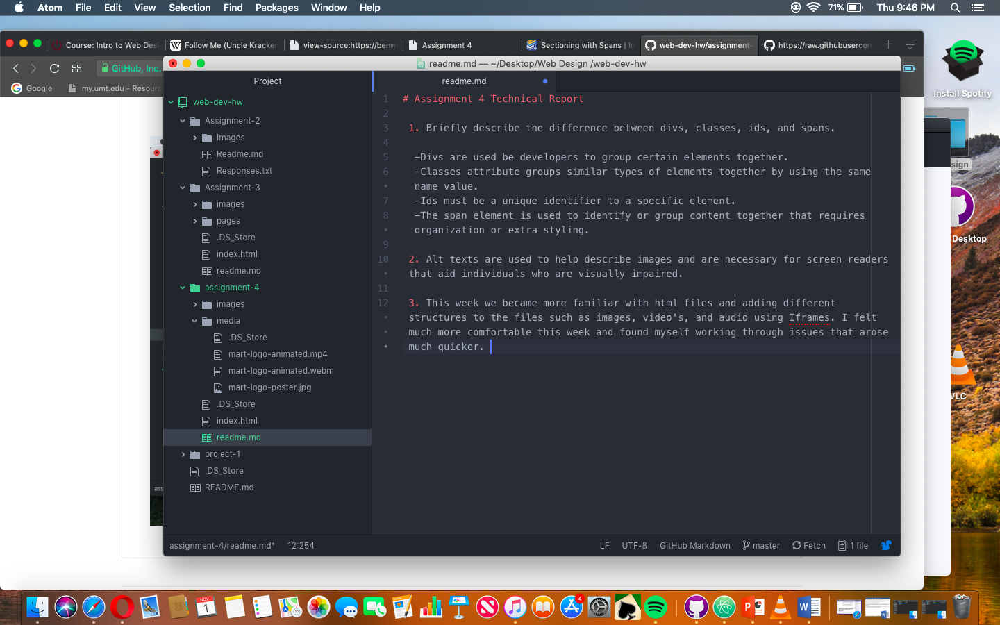

# Assignment 4 Technical Report

 1. Briefly describe the difference between divs, classes, ids, and spans.

  -Divs are used be developers to group certain elements together.
  -Classes attribute groups similar types of elements together by using the same name value.
  -Ids must be a unique identifier to a specific element.
  -The span element is used to identify or group content together that requires organization or extra styling.

 2. Alt texts are used to help describe images and are necessary for screen readers that aid individuals who are visually impaired.

 3. This week we became more familiar with html files and adding different structures to the files such as images, video's, and audio using Iframes. I felt much more comfortable this week and found myself working through issues that arose much quicker.

