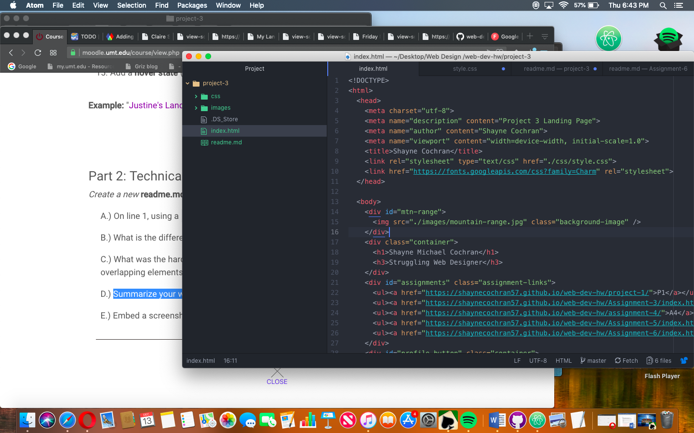

# Project 3 Technical Report

1. What is the difference between padding, margin, and borders?
    - Padding is the amount of space between the inner content of the element and the element itself.
    - Margin is the space between the box/element and other elements, or the edge of the parent element.
    - Borders help define the amount of space a box or element takes up, as well as its relationship to other boxes.

2. What was the hardest task for you to accomplish this assignment?
    - The hardest part of this assignment was overlapping. You'll obviously be able to tell that I didn't do it right once you look at my live site which was very disappointing to me because I spent hours trying to figure  it out. I haven't really been able to figure out the styles.css sheet since we started using one and I think if I could have understood that element of the assignment better, my life site would look much better.
    - I've come to realize that web design may not be my best subject but nonetheless I've really enjoyed how much it has challenged me throughout the course of the semester.

    

  
